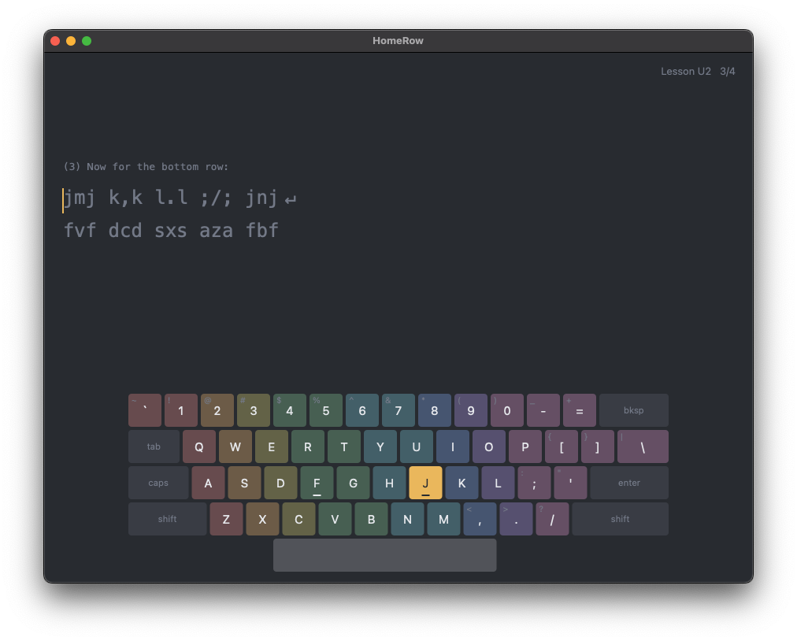
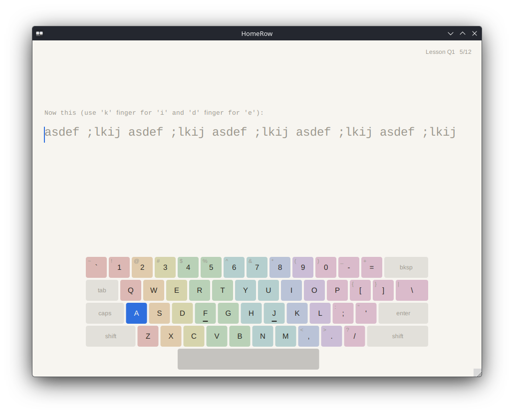
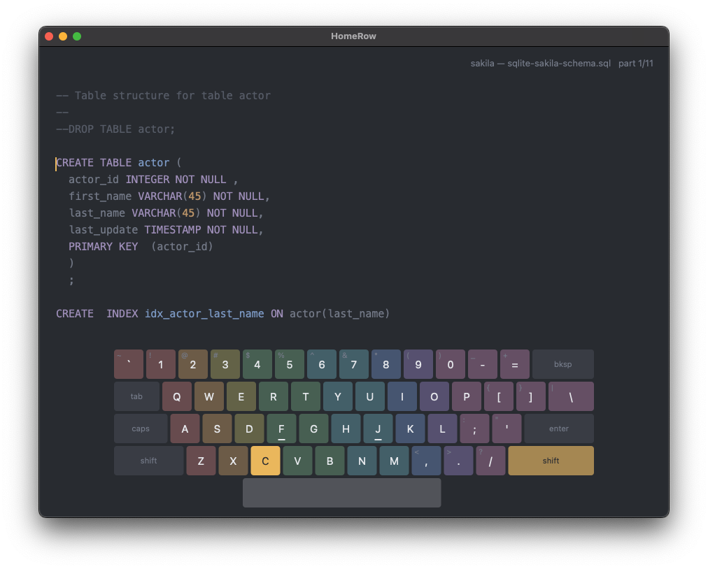
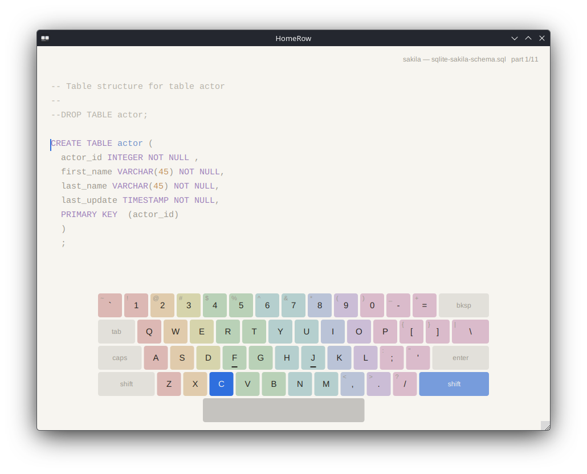
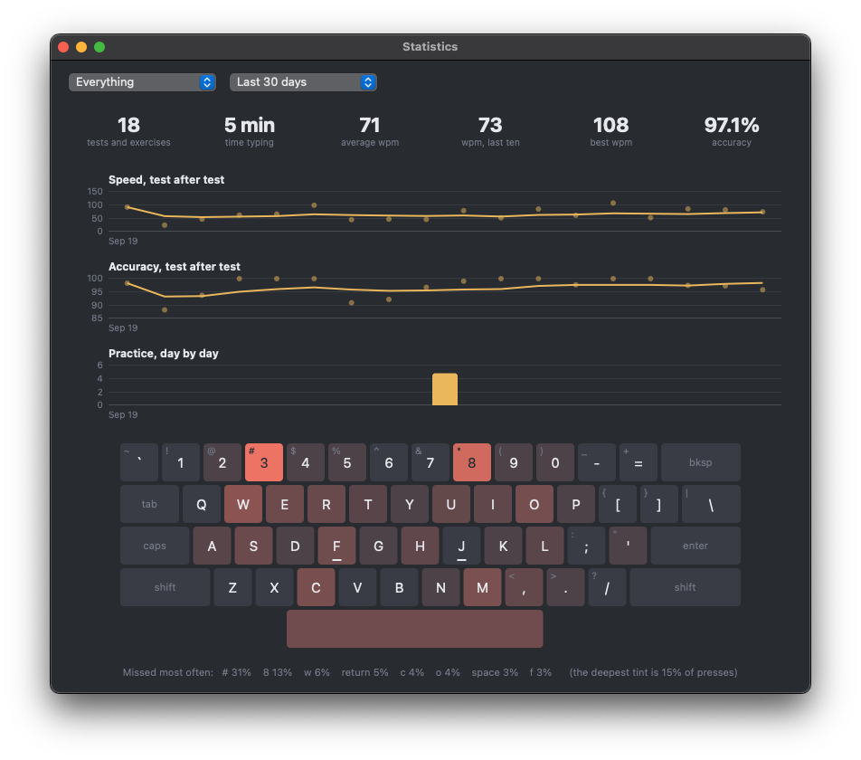
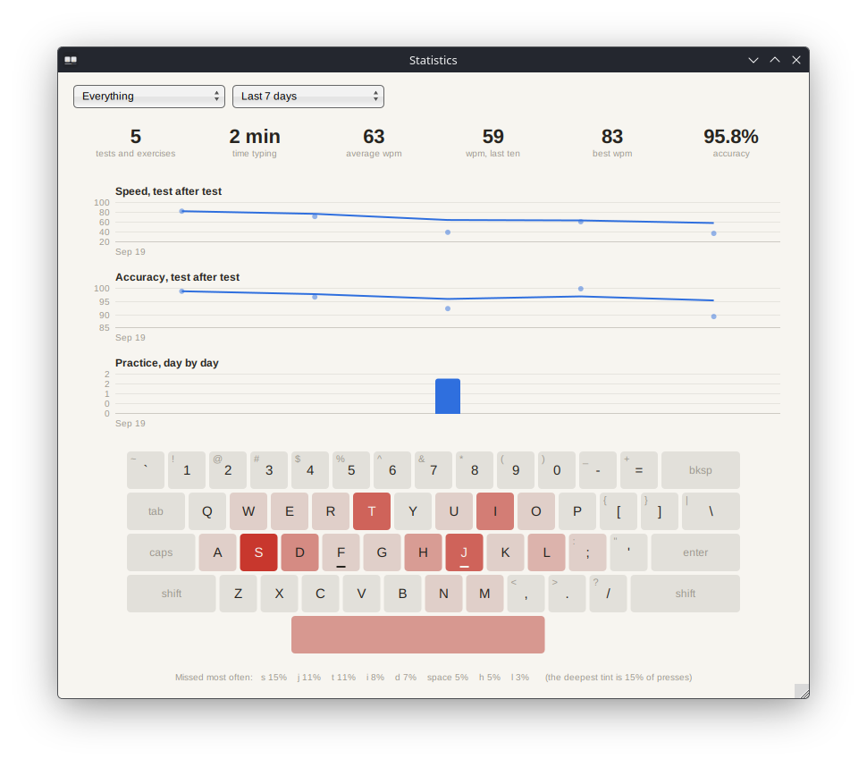
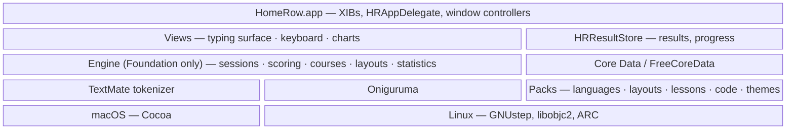

# HomeRow

A native typing tutor for **macOS and Linux (GNUstep)**: a touch-typing course
for people starting from zero, quick tests in the spirit of MonkeyType, and real
source code to type in the spirit of Typing.io. It runs offline, has no
accounts and no telemetry, and is free software (GPL-3.0-or-later).
Objective-C 2.0 with ARC, XIB-based UI, one source tree for both platforms.

| | macOS | Linux (GNUstep) |
|---|:---:|:---:|
| **Courses** |  |  |
| **Code** |  |  |
| **Statistics** |  |  |

## Get it

There is no tagged release yet. Until there is, every push builds both
downloads: open the latest green run under
[Actions](https://github.com/ashalkhakov/HomeRow/actions/workflows/ci.yml) and
take the artifact for your platform.

| Platform | Artifact | Contains |
|---|---|---|
| macOS 11 Big Sur or later | `HomeRow-macOS-<commit>` | Universal app (Intel and Apple silicon), ad-hoc signed: right-click ▸ Open the first time |
| Linux x86_64 | `HomeRow-Linux-<commit>` | One file with GNUstep, FreeCoreData and fonts inside; `chmod +x`, then run it |

Build from source:

    # macOS
    xcodebuild -project HomeRow.xcodeproj -scheme HomeRow build
    # Linux, with a from-source GNUstep prefix (see docs/building.md)
    make && make check && openapp ./HomeRow/HomeRow.app

On Linux, use the AppImage unless you are developing: HomeRow needs clang,
libobjc2 and ARC, which distribution GNUstep packages do not provide.
Details: [docs/building.md](docs/building.md).

## What works

- **Courses** — GNU Typist's 46 courses (QWERTY, Dvorak, Colemak, the numeric
  keypad, and courses in 17 more languages, German, Russian, Spanish and French
  among them), followed rather than merely opened: HomeRow keeps your place
  down to the exercise, repeats a drill that had too many errors, records
  every lesson's best speed and accuracy, and lets several courses run side by
  side.
- **On-screen keyboard** — 239 layouts, finger zones tinted, the next key lit
  together with the Shift of the *other* hand, Backspace lit when a mistake
  has to go first, the key you hit by mistake in red.
- **Tests** — time, words, zen and custom-text tests in 140 languages, with
  punctuation and numbers, live WPM and accuracy, and a results screen with a
  per-second chart.
- **Code** — 23 real source files in C, Objective-C, C#, Python, JavaScript,
  TypeScript, Go, Rust, SQL and shell, plus any file of your own. Typed the way
  an editor has you type it: indentation, blank lines and comments fill
  themselves in, and a wrong key does not go in. Syntax colours come from the
  **TextMate grammars** VS Code uses, run by a tokenizer written for HomeRow.
- **Statistics** — headline numbers, speed and accuracy test after test with a
  moving average, practice day by day, and the keyboard tinted by how often
  each key is missed; for everything or for tests, courses or code alone.
- **Your data stays yours** — results go into a Core Data store on your disk
  (Apple's on macOS, [FreeCoreData](https://github.com/ashalkhakov/FreeCoreData)
  on GNUstep) and nowhere else.
- **Extensible without code** — languages, keyboard layouts, courses, themes
  and programming languages are data packs: see [Documentation](#documentation).

How to use all of it, with every shortcut: [docs/using.md](docs/using.md).

## Limitations

- **Input methods** that convert text after it is typed (Chinese, Japanese,
  Korean) are not supported; dead keys and Option accents are. On macOS a held
  key repeats and does not open the accent pop-up.
- **No weak-spot practice yet.** The statistics show which keys you miss;
  lessons generated from that come next.
- **Statistics are charts only** — no list of single results, no export.
- **Code mode** has no code-specific metrics yet, never asks for Tab, and
  TextMate grammar *injections* are ignored (none of the bundled languages
  needs them).
- **Not imported:** right-to-left languages, languages that need an input
  method (Chinese, Japanese, Korean), word lists over 10,000 words. Three
  courses (Czech, Slovenian, Romanian) and the keypad courses have no
  keyboard to show.
- **English interface only.**
- **No signed or notarized macOS build** until the release secrets are set.

The plan, phase by phase: [docs/feature-set.md](docs/feature-set.md); the working list: [docs/roadmap.md](docs/roadmap.md).

## Architecture

An engine that knows nothing of windows, a thin AppKit layer that is the same
code on both platforms, and content that is all data.

Everything under `Engine/` is free of AppKit and takes its timestamps as
arguments, so the rules — what counts as an error, when a drill repeats, how a
file is cut into parts, what a grammar makes of a line — are tested without a
display: 61 XCTest cases, including vscode-textmate's own tokenizer suite, run
on both platforms in CI. What cannot be unit-tested is covered by a smoke test
built into the app (`HR_SMOKE_TEST=1`): CI starts the packaged AppImage and the
macOS app, which check their own outlets, type a test, a lesson and a section
of code, open every window, and exit 0.

| Path | What |
|---|---|
| `HomeRow/Engine/` | Sessions, scoring, text sources, GNU Typist scripts, course runs, keyboard layouts, TextMate grammars, code documents, statistics |
| `HomeRow/` | App delegate, views, window controllers, the Core Data store |
| `HomeRow/Resources/` | XIBs and the packs: `Languages/` `Layouts/` `Lessons/` `Code/` `Themes/` |
| `HomeRow/HomeRow.xcdatamodeld` | The data model — compiled by Xcode on macOS, by FreeCoreData's `momc` on GNUstep |
| `HomeRow/ThirdParty/oniguruma/` | The regular expression engine TextMate grammars need |
| `HomeRowTests/` | XCTest sources and fixtures |
| `HomeRow.xcodeproj` · `GNUmakefile` | The two builds, side by side |
| `Scripts/` | Importers for the packs, AppImage packaging, version stamping |
| `patches/gnustep/` | gnustep-gui fixes applied when CI builds GNUstep |

## Documentation

- [Using HomeRow](docs/using.md) — keys, courses, code, statistics
- [Building and packaging](docs/building.md)
- Adding [a language](docs/adding-a-language.md), [a keyboard layout](docs/adding-a-layout.md), [a programming language](docs/adding-a-code-language.md)
- [How the numbers are worked out](docs/metrics.md) · [Feature set and phases](docs/feature-set.md) · [Roadmap](docs/roadmap.md)
- [GNUstep patches](patches/gnustep/README.md)

## Where the content comes from

HomeRow is GPL-3.0-or-later so that it can stand on two GPL projects: the
courses are [GNU Typist](https://www.gnu.org/software/gtypist/)'s lesson files,
unmodified, and the word lists and keyboard layouts are
[MonkeyType](https://github.com/monkeytypegame/monkeytype)'s. The source files
of code mode come from well-known projects under permissive licences, each
unmodified and recorded with its commit; the grammars are the ones VS Code
bundles (MIT); [Oniguruma](https://github.com/kkos/oniguruma) is BSD.
MonkeyType's quote collection is *not* used: its licence covers the collection,
not the books and films the quotes are from. Everything is listed in
[THIRD-PARTY](THIRD-PARTY).

## License

[GPL-3.0-or-later](COPYING).
