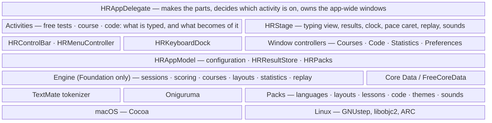

# HomeRow

A native typing tutor for **macOS and Linux (GNUstep)**: a touch-typing course
for people starting from zero, quick tests in the spirit of MonkeyType, and real
source code to type in the spirit of Typing.io. It runs offline, has no
accounts and no telemetry, and is free software (GPL-3.0-or-later).
Objective-C 2.0 with ARC, XIB-based UI, one source tree for both platforms.

| | macOS | Linux (GNUstep) |
|---|:---:|:---:|
| **Courses** |  |  |
| **Code** |  |  |
| **Statistics** |  |  |

## Get it

Take the files from the [latest release](https://github.com/ashalkhakov/HomeRow/releases/latest):

| Platform | File | To run it |
|---|---|---|
| macOS 11 Big Sur or later, Intel and Apple silicon | `HomeRow-macOS-<version>.zip` | Unzip, move to Applications, open. A file named `…-unsigned.zip` is not notarized: right-click ▸ Open the first time |
| Linux x86_64 | `HomeRow-Linux-<version>-x86_64.AppImage` | `chmod +x`, then run it. GNUstep, FreeCoreData and fonts are inside; key sounds use the system's libao if it is there |

Between releases, every push builds the same two downloads: open the latest
green run under
[Actions](https://github.com/ashalkhakov/HomeRow/actions/workflows/ci.yml) and
take `HomeRow-macOS-<commit>` or `HomeRow-Linux-<commit>`.

Build from source:

    # macOS
    xcodebuild -project HomeRow.xcodeproj -scheme HomeRow build
    # Linux, with a from-source GNUstep prefix (see docs/building.md)
    make && make check && openapp ./HomeRow/HomeRow.app

On Linux, use the AppImage unless you are developing: HomeRow needs clang,
libobjc2 and ARC, which distribution GNUstep packages do not provide.
Details: [docs/building.md](docs/building.md).

## What works

- **Courses** — GNU Typist's 46 courses (QWERTY, Dvorak, Colemak, the numeric
  keypad, and courses in 17 more languages, German, Russian, Spanish and French
  among them), followed rather than merely opened: HomeRow keeps your place
  down to the exercise, repeats a drill that had too many errors, records
  every lesson's best speed and accuracy, and lets several courses run side by
  side.
- **On-screen keyboard** — 239 layouts, finger zones tinted, the next key lit
  together with the Shift of the *other* hand, Backspace lit when a mistake
  has to go first, the key you hit by mistake in red.
- **Tests** — time, words, zen and custom-text tests in 140 languages, with
  punctuation and numbers, live WPM and accuracy, and a results screen with a
  per-second chart. A **pace caret** runs ahead at your average, your best or
  a speed you choose; **r** on a result plays the test back as it was typed;
  key sounds if you like them.
- **A first launch that asks** whether you want to be taught or tested, and
  starts the course for your layout or a test accordingly.
- **Code** — 23 real source files in C, Objective-C, C#, Python, JavaScript,
  TypeScript, Go, Rust, SQL and shell, plus your own: files and whole project
  folders, dropped on the window. Typed the way an editor has you type it:
  indentation, blank lines and comments fill themselves in (Tab can be yours
  where the code goes deeper), and a wrong key does not go in. A section
  reports its keystroke overhead and how brackets and operators went compared
  with letters. Keyword lists for some sixty languages sit beside the prose
  languages. Syntax colours come from the
  **TextMate grammars** VS Code uses, run by a tokenizer written for HomeRow.
- **Statistics** — headline numbers, speed and accuracy test after test with a
  moving average, practice day by day, and the keyboard as a heatmap of
  mistakes or of speed; a history of every result with its per-second chart
  and personal bests; progress through each course and code file.
- **Your history is portable** — export to JSON (everything) or to CSV with
  [MonkeyType's columns](docs/results-format.md); import either, or a MonkeyType
  export. That is also how it moves between machines.
- **Weak-spot practice** — rounds of words weighted towards the keys you miss
  clearly more often than your own average; weak capitals and symbols are
  worked into the words.
- **Your data stays yours** — results go into a Core Data store on your disk
  (Apple's on macOS, [FreeCoreData](https://github.com/ashalkhakov/FreeCoreData)
  on GNUstep) and nowhere else.
- **Extensible without code** — languages, keyboard layouts, courses, themes
  and programming languages are data packs: see [Documentation](#documentation).

How to use all of it, with every shortcut: [docs/using.md](docs/using.md).

## Limitations

- **Input methods** that convert text after it is typed (Chinese, Japanese,
  Korean) are not supported; dead keys and Option accents are. On macOS a held
  key repeats and does not open the accent pop-up.
- **Weak-spot practice goes by single keys**, missed or slow, not yet by
  letter pairs.
- **No sync.** Moving a history between machines is export and import by hand;
  the place in a course does not travel yet.
- **Code mode** ignores TextMate grammar *injections* (none of the bundled
  languages needs them), and a folder brings only files in the ten languages
  it has grammars for.
- **Not imported:** right-to-left languages, languages that need an input
  method (Chinese, Japanese, Korean), word lists over 10,000 words. Three
  courses (Czech, Slovenian, Romanian) and the keypad courses have no
  keyboard to show.
- **English interface only.**
- **The macOS build is signed and notarized only once the release secrets are
  set** ([releasing.md](docs/releasing.md)); until then it is ad-hoc signed.
- **Key sounds are synthesized**, not recorded, and on Linux need the
  system's libao.

The plan, phase by phase: [docs/feature-set.md](docs/feature-set.md); the working list: [docs/roadmap.md](docs/roadmap.md).

## Architecture

An engine that knows nothing of windows, a thin AppKit layer that is the same
code on both platforms, and content that is all data.

The app layer is a handful of objects with one job each. An *activity*
(`HRFreeTestActivity`, `HRCourseActivity`, `HRCodeActivity`) knows what there
is to type and what becomes of it — which lesson, which file, where the
bookmark is, what gets recorded — and knows nothing about views. The *stage*
(`HRStage`) knows how to put a session, a page or a result on screen, runs the
clock, the pace caret, the replay and the sounds — and knows nothing about
courses or files. The app delegate introduces them to each other: it hands the
stage's news to whichever activity is on, and when an activity takes the stage
it lets the others go and has the control bar, the menus and the on-screen
keyboard follow.

Everything under `Engine/` is free of AppKit and takes its timestamps as
arguments, so the rules — what counts as an error, when a drill repeats, how a
file is cut into parts, what a grammar makes of a line — are tested without a
display: 88 XCTest cases, including vscode-textmate's own tokenizer suite, run
on both platforms in CI. What cannot be unit-tested is covered by a smoke test
built into the app (`HR_SMOKE_TEST=1`): CI starts the packaged AppImage and the
macOS app, which check their own outlets, type a test, a lesson and a section
of code, replay the test, open every window, and exit 0.

| Path | What |
|---|---|
| `HomeRow/Engine/` | Sessions, scoring, text sources, packs (`HRPacks`: where languages, layouts and courses are read), GNU Typist scripts, course runs, keyboard layouts, TextMate grammars, code documents, statistics |
| `HomeRow/` | The app: `HRAppDelegate`, `HRAppModel`, `HRStage`, the activities, `HRControlBar`, `HRKeyboardDock`, `HRMenuController`; views, window controllers, the Core Data store; `HRSmokeTest` |
| `HomeRow/Resources/` | XIBs and the packs: `Languages/` `Layouts/` `Lessons/` `Code/` `Themes/` |
| `HomeRow/HomeRow.xcdatamodeld` | The data model — compiled by Xcode on macOS, by FreeCoreData's `momc` on GNUstep |
| `HomeRow/ThirdParty/oniguruma/` | The regular expression engine TextMate grammars need |
| `HomeRowTests/` | XCTest sources and fixtures |
| `HomeRow.xcodeproj` · `GNUmakefile` | The two builds, side by side |
| `Scripts/` | Importers for the packs, AppImage packaging, version stamping |
| `patches/gnustep/` | gnustep-gui fixes applied when CI builds GNUstep |

## Documentation

- [Using HomeRow](docs/using.md) — keys, courses, code, statistics
- [Building and packaging](docs/building.md) · [Releasing](docs/releasing.md)
- Adding [a language](docs/adding-a-language.md), [a keyboard layout](docs/adding-a-layout.md), [a programming language](docs/adding-a-code-language.md)
- [How the numbers are worked out](docs/metrics.md) · [The results file](docs/results-format.md) · [Feature set and phases](docs/feature-set.md) · [Roadmap](docs/roadmap.md)
- [GNUstep patches](patches/gnustep/README.md)

## Where the content comes from

HomeRow is GPL-3.0-or-later so that it can stand on two GPL projects: the
courses are [GNU Typist](https://www.gnu.org/software/gtypist/)'s lesson files,
unmodified, and the word lists and keyboard layouts are
[MonkeyType](https://github.com/monkeytypegame/monkeytype)'s. The source files
of code mode come from well-known projects under permissive licences, each
unmodified and recorded with its commit; the grammars are the ones VS Code
bundles (MIT); [Oniguruma](https://github.com/kkos/oniguruma) is BSD.
MonkeyType's quote collection is *not* used: its licence covers the collection,
not the books and films the quotes are from. Everything is listed in
[THIRD-PARTY](THIRD-PARTY).

## License

[GPL-3.0-or-later](COPYING).
